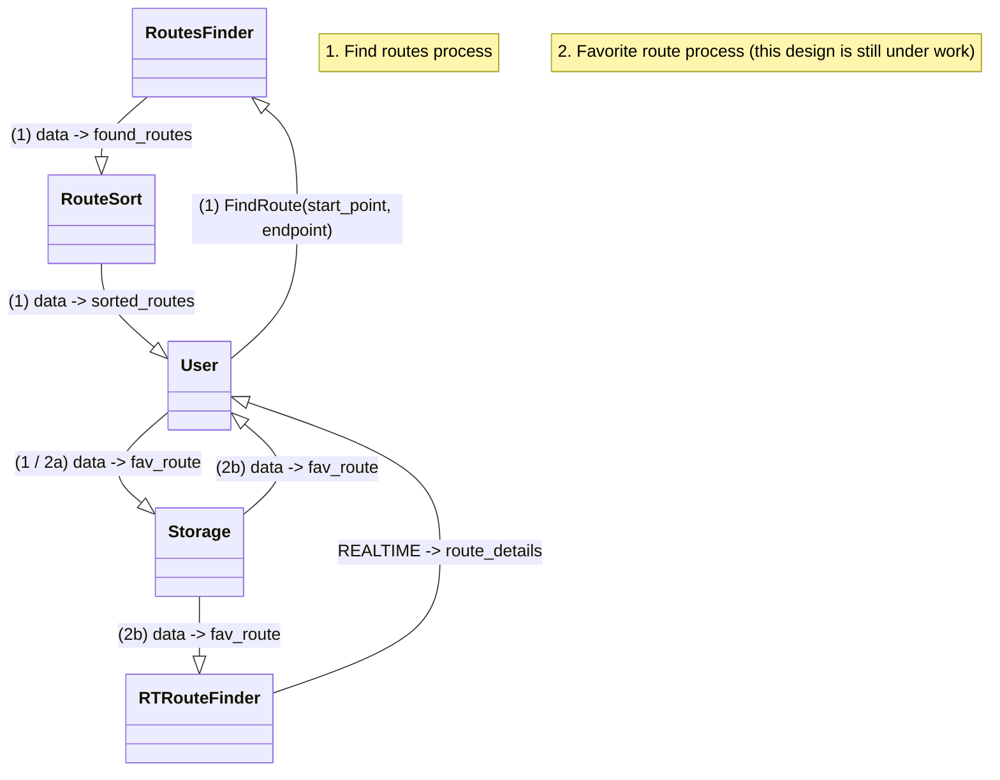

# MTA Project: Route Suggestion App

# 1) Basic MVP Ideas: _1/2/25_

-   Users are offered multiple ways to get to their destination, starting with shortest travel duration to longest
-   Users can create their own routes & have a spot to save their favorite routes
-   Routs are updated live based on delays & incidents/accidents

# 2) Planning User Process: _1/8/25_

## Frontend or Backend?

| Frontend/backend? | Steps                                                                      | MVP? |
| ----------------- | -------------------------------------------------------------------------- | ---- |
| F                 | User enters start and end point                                            | Y    |
| Data transfer:API | start and end points; front → back                                         | Y    |
| B                 | routes are found                                                           | Y    |
| B                 | Routes are ordered                                                         | Y    |
| Data transfer:API | ordered routes; back → front                                               | N    |
| F                 | Routes presented to user                                                   | Y    |
| F                 | User selects their route and uses it                                       | Y    |
| F/B               | guided through the route entire trip; alternatives offered if delays found | N    |

## Extras (Not necessary for MVP)

-   **In-house graph traversal** ⇒ start with a module that handles that for now
-   **Map Visual** ⇒ First implement route finding and simple presenting with route description; visualization is secondary

# 3) Simplification: _1/8/25_

1. **Receive and process** start and destination
2. **Find** routes
3. **Compare** routes **in terms of time**
4. **Present** routes in said order
5. **Display chosen route** to user

# 4) Extremely Abstract Graph: 1/8/25

**_Note: RouteFinder and RouteSort will have to be further detailed…_**

# 5) Data…

## Sources

MTA’s GTFS (schedule and real-time)
